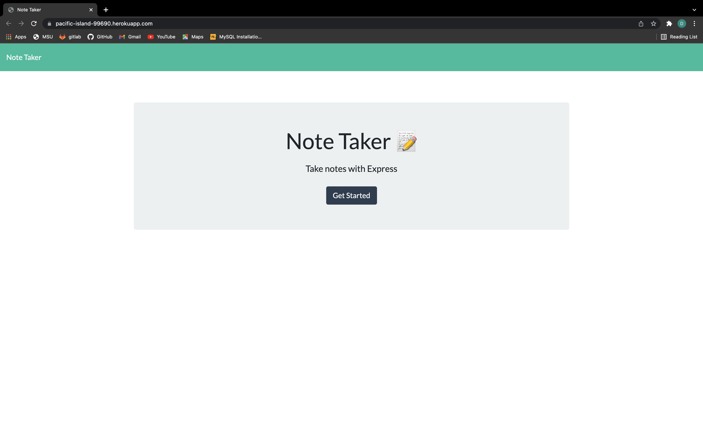
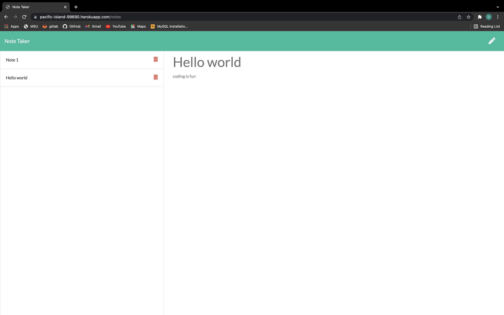

# Note Taker
  ## Table of Contents
  * [Project Description](#project-description)
  * [Installation](#installation)
  * [License](#license)
  * [Contributing](#contributing)
  * [Questions?](#questions)
  ## Project Description
  Create an application that can be used to write, save, and delete notes. This application will use an express backend and save and retrieve note data from a JSON file.
  ## Installation
  npm init -y , npm i express
  ## License
  This project is under MIT for licensing.
  
  ## Contributing
  feel free to submit any code
  ## Website link
  https://pacific-island-99690.herokuapp.com/notes

  
  
  ## Questions
  please feel free to ask me any questions.
  Github username: Dylanbitto
  Github Email: <dylanbitto5425@gmail.com>
  
